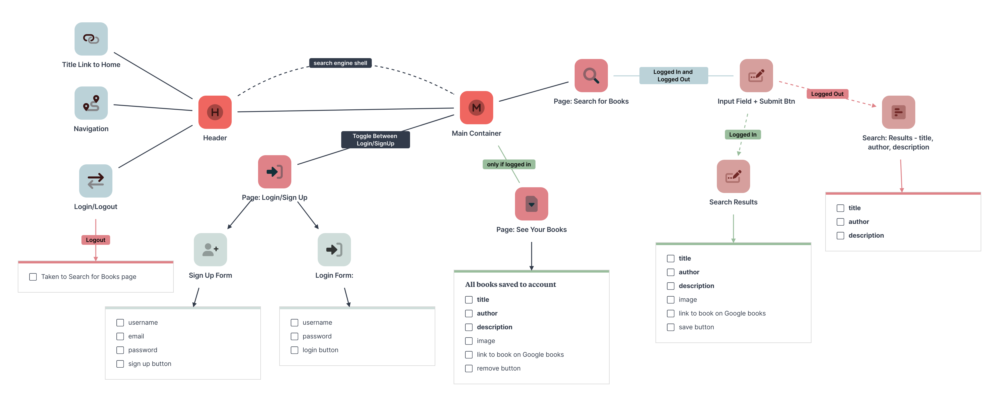

# MyBook Search Engine

## Description

I refactored a functioning Google Books API search engine built with a RESTful API into a single page application with a GraphQL API built through the Apollo Server. To accomplish this, I created GraphQL queries and modifiers, set up the Apollo Server, modified the existing authentication middleware, and created an Apollo Provider.

As the full stack developer for this project, I implemented the MERN stack with the following technologies: ReactJS, Apollo GraphQL, MongoDB, Mongoose, ExpressJS, Sequelize.

## Table of Contents
- [React-Portfolio](#React-Portfolio)
  - [Description](#description)
  - [Table of Contents](#table-of-contents)
  - [Links](#links)
  - [App Preview](#app-preview)
    - [Logged In](#logged-in)
    - [Logged Out](#logged-out)
    - [Site Map](#site-map)
  - [Documentation](#documentation)
  - [Dependencies](#dependencies)
  - [License](#license)
  - [Credits](#credits)
    - [React Library](#react-library)
    - [Tutorials](#tutorials)
    - [Example Code](#example-code)
  - [Badges](#badges)
    - [Cloud Service](#cloud-service)
    - [Database](#database)
    - [Frameworks and Libraries](#frameworks-and-libraries)
    - [Integrated Development Environments (IDE)](#untegrated-development-environments-ide)
    - [Languages](#languages)
    - [Linter](#linter)
## Links

[TBD Deployed Site]()

[GitHub Repository](https://github.com/victoriamcn/book-search-engine)

## App Preview

### Logged In

### Logged Out

### Site Map

*Made with [Milanote](https://www.milanote.com/refer/rcEpkqyVyNt7y3JS1C).*

## Documentation

This project was bootstrapped with [Create React App](https://github.com/facebook/create-react-app).

### Scripts

In the project directory, you can run the following scripts:

`npm start`

- Runs the app in the development mode. Open [http://localhost:3000](http://localhost:3000) to view it in your browser.

`npm run build`

- Builds the app for production to the `build` folder. It correctly bundles React in production mode and optimizes the build for the best performance. The build is minified and the filenames include the hashes. Your app is ready to be deployed!

See the section about [deployment](https://facebook.github.io/create-react-app/docs/deployment) for more information.

## Dependencies

1. [bcrypt](https://www.npmjs.com/package/bcrypt) 
2. [concurrently](https://www.npmjs.com/package/concurrently)
3. [dotenv](https://www.npmjs.com/package/dotenv)
4. [mongoose](https://www.npmjs.com/package/mongoose)

## License

[Read more here.](https://www.apache.org/licenses/LICENSE-2.0)

## Credits

### React Library

You can learn more in the [Create React App documentation](https://facebook.github.io/create-react-app/docs/getting-started).

### Tutorials

- Apollo Docs: [apollo-server-express](https://www.apollographql.com/docs/apollo-server/v3/integrations/middleware/#apollo-server-express)
- Apollo Docs: [SETTING UP APOLLO CLIENT](https://www.apollographql.com/tutorials/fullstack-quickstart/07-setting-up-apollo-client)
- Apollo Docs: [THE USEMUTATION HOOK](https://www.apollographql.com/tutorials/lift-off-part4/08-the-usemutation-hook)
- Community.ApolloGraphQL: [GraphQL Query Issue Array of Objects](https://community.apollographql.com/t/graphql-query-issue-array-of-objects/5848)
- GitHub apollographql/apollo-client: [Calls are being made to localhost, instead of given uri, using new HttpLink() #3069](https://github.com/apollographql/apollo-client/issues/3069)
- Mongo Developer Communnity: [MongooseServerSelectionError: connect ECONNREFUSED 127.0.0.1:27017](https://www.mongodb.com/community/forums/t/mongooseserverselectionerror-connect-econnrefused-127-0-0-1-27017/123421)

-  
-  
-  

### Example Code

- GitHub: [Lemming97](https://github.com/Lemming97/React_Portfolio/blob/main/src/components/Contact/index.js)
- GitHub: [EmilyNecciai](https://github.com/EmilyNecciai/react-portfolio/blob/main/src/components/Contact.js)

## Badges

### Cloud Service

### Database

### Frameworks and Libraries

### Integrated Development Environments (IDE)

### Languages

### Linter

